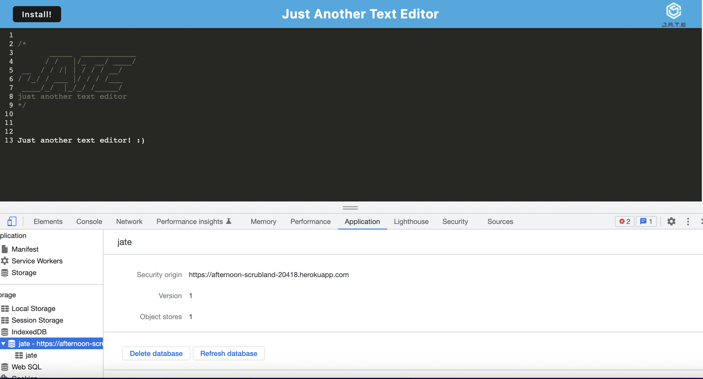

# PWA-textEditor


## Heorku Deployment

[Heroku deployment link](https://afternoon-scrubland-20418.herokuapp.com/)



## License 


## Description 

This is a single-page text editor application that runs in the browser and meets the PWA criteria. The application is accessible on and offline and features a number of data persistant techniques such as INdexedDB datatbase. 


## Table of Contents 

[Installation](#Installation)


[Usage](#Usage)


[License](#License)


[Questions](#Questions)


## Installtion

The application requires Node js. To install this application you will clone the repository to your local machine. 


## Usage 

To run the application locally run the following commands: 

Install application: ``` npm install ```

Run application: ```npm run start```

To run in development mode: ``` npm run start:dev ```


## License 

MIT License 

## Questions 

Elia Martinez 

Email: [eliahaydeemartinez@gmail.com](eliahaydeemartinez@gmail.com)


GitHub: [Here is the link to my github page](https://github.com/EliaMart)